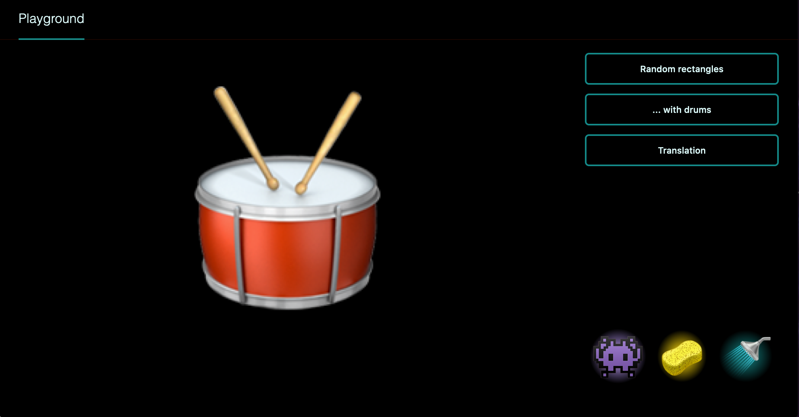

# Fuzzy Playground 👾

An evolving environment to play, experiment and learn about web graphics and user interfaces

**What does that even mean ?**

Its basically a web application that uses Svelte to handle the state management necessary to run and interact with WebGL examples given as part of the https://webglfundamentals.org/ tutorial.

The app displays a canvas, a feedback area (displayed only when there are errors in the code), and provides some controls:

- 👾 a Play button
- 🧽 a Reset button (reset current animation)
- 🚿 a Refresh button (reloads the page for now)
- an Animations menu
- inputs for 2D coordinates (for now)



You can play with it here:

https://fuzzy-playground.patiboh.vercel.app/

**Is that all??**

Yes, for now =)

The development is tied to my learning WebGL, which is why it's evolving, and a playground.
I also take some time to learn Svelte & Sapper as I go along.

If I don't end up fedup by all the emojis, I might continue to use the same setup for experimenting with other interactive graphics libraries that make use of the Canvas element

## Getting started

src: [Sapper template](https://github.com/sveltejs/sapper-template) README

### Running the project

However you get the code, you can install dependencies and run the project in development mode with:

```bash
npm install # or yarn
npm run dev
```

Open up [localhost:3000](http://localhost:3000) and start clicking around.
Consult [sapper.svelte.dev](https://sapper.svelte.dev) for help getting started.

## Libraries & Resources:

**Animation success / error**
Inspired by the [Svelte tutorial](https://svelte.dev/tutorial/basics) confetti - I loved this from the first time I saw it, I just couldn't help it 😍 - and this [tweet by @cassidoo](https://twitter.com/cassidoo/status/1280239175078273024?s=20)

- [Sapper](https://github.com/sveltejs/sapper)
- [Svelte](https://svelte.dev/)
- [Svelte tutorial](https://svelte.dev/tutorial/basics): the best intro to Svelte, and source of the emoji animations
- WebGL examples from https://webglfundamentals.org/
- Drumroll sample from https://freesound.org/people/adriann/sounds/191718/

## TODO

- Get back to the WebGL bits!
- Explore how to use Svelte better
