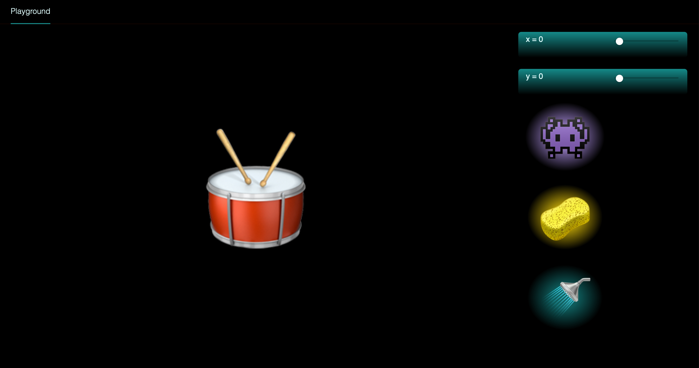
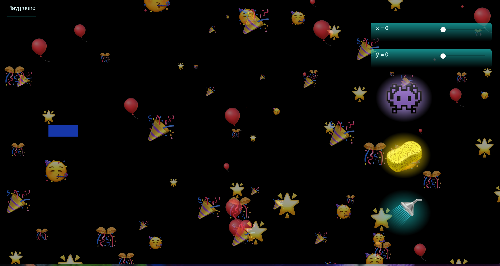
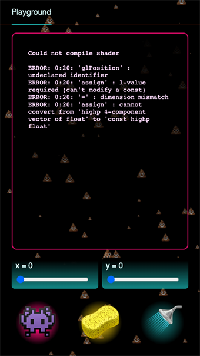

# Fuzzy Playground 👾

An evolving environment to play, experiment and learn about web graphics and user interfaces

**What does that even mean ?**

Its basically a web application that uses Svelte to handle the state management necessary to run and interact with WebGL examples given as part of the https://webglfundamentals.org/ tutorial.
The interface also handles errors by providing visual feedback on screen (=== totally overkill emoji ❤️) rather than only logs in the console (although it does log the error message on screen as part of the feedback).

The app displays a canvas, a feedback area (displayed only when there are errors in the code), and provides some controls:

- a Play button
- a Refresh button (reloads the page for now)
- a "Clear emojis button" (to stop the emojis)
- inputs for 2D coordinates (for now)

Some screenshots below

**Default state**


**Animation success**
(yes is OTT I know, specially since it happens pretty often, but I loved this from the first time I saw it, I just couldn't help it 😍)



**Animation error**


Some screenshots below

**Is that all??**

Yes, for now =)

The development is tied to my learning WebGL, which is why it's evolving, and a playground.
I also take some time to learn Svelte & Sapper as I go along.

If I don't end up fedup by all the emojis, I might continue to use the same setup for experimenting with other interactive graphics libraries that make use of the Canvas element

## Getting started

src: [Sapper template](https://github.com/sveltejs/sapper-template) README

### Running the project

However you get the code, you can install dependencies and run the project in development mode with:

```bash
npm install # or yarn
npm run dev
```

Open up [localhost:3000](http://localhost:3000) and start clicking around.
Consult [sapper.svelte.dev](https://sapper.svelte.dev) for help getting started.

## Libraries & Resources:

- [Sapper](https://github.com/sveltejs/sapper) (mainly because I wanted to do TDD using Cucumber - this has proven more challenging than I expected)
- [Svelte](https://svelte.dev/)
- [Svelte tutorial](https://svelte.dev/tutorial/basics): the best intro to Svelte, and source of the emoji animations
- WebGL examples from https://webglfundamentals.org/
- Drumroll sample from https://freesound.org/people/adriann/sounds/191718/
